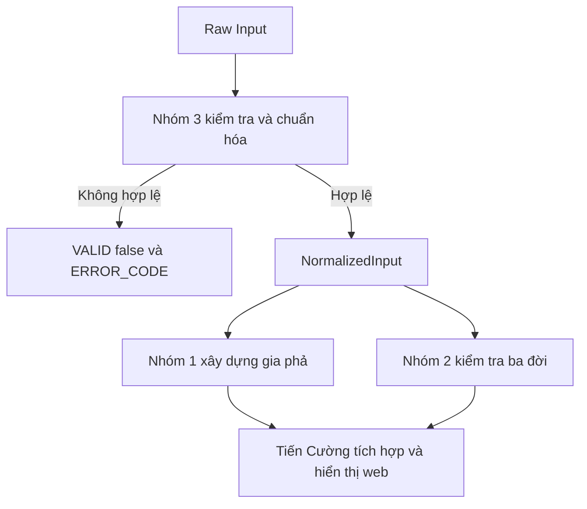

# Kế hoạch thực hiện project đồ thị gia phả

- **Chủ đề:** Ứng dụng đồ thị trong xây dựng gia phả và kiểm tra quan hệ trong ba đời
- **Lead:** Tiến Cường
- **Thành viên:** Phương Mai, Kim Chi, Đắc Thịnh, Đức Tiến, Đăng Doanh và Tiến Cường
- **Deadline:** Hoàn thành sản phẩm trong tuần 7 và thuyết trình từ tuần 8

## Mục tiêu và kiến trúc

Nhóm ưu tiên một sản phẩm gọn, chạy ổn định và dễ trình bày. Các chi tiết cài đặt được thống nhất sau khi từng nhóm hoàn thành phần nghiên cứu.

### Mục tiêu sản phẩm

- Biểu diễn gia phả bằng đồ thị có hướng.

- Xác định các quan hệ cha, mẹ, ông, bà, con và cháu.

- Dùng BFS để kiểm tra quan hệ trong phạm vi ba đời.

- Trực quan hóa gia phả và làm nổi bật các đường liên hệ dùng làm bằng chứng.

- Tổng hợp thuật toán, trace bằng tay, kết quả chạy, kiểm thử và độ phức tạp thành slide thuyết trình 15 đến 20 phút.

### Kiến trúc

| Kiến trúc | Nội dung |
|---|---|
| Ngôn ngữ chính | Java |
| Mô hình | Gia phả được biểu diễn bằng đồ thị có hướng. Cạnh đi từ cha hoặc mẹ đến con. |
| Thuật toán chính | Nhóm 3 kiểm tra và chuẩn hóa Input; Kahn tạo TOPO_ORDER; phép duyệt theo mức tạo `relationLevels`; BFS kiểm tra tổ tiên chung. |
| Sản phẩm tối thiểu | Các module Java trao đổi bằng Java object, trả output thô và được Tiến Cường tích hợp lên web. |
| Giao diện | Web đơn giản do Tiến Cường tích hợp ở giai đoạn cuối, sau khi thuật toán và hợp đồng dữ liệu đã ổn định. |
| Mốc đóng băng | Cuối tuần 5 dừng thêm chức năng lớn. Tuần 6 và 7 dành cho tích hợp, sửa lỗi, tài liệu và diễn tập. |

## Chi tiết bài toán và đặc tả Input Output

### Phát biểu bài toán

Cho một đồ thị có hướng G = (V, E) biểu diễn gia phả:

- Mỗi đỉnh trong V đại diện cho một người.

- Mỗi cạnh A → B cho biết A là cha hoặc mẹ của B.

- Đồ thị hợp lệ không được có chu trình.

Chương trình hỗ trợ hai yêu cầu:

- Hiển thị gia phả của một người trong số đời được yêu cầu.

- Kiểm tra hai người có tổ tiên chung trong phạm vi ba đời hay không.

### Dữ liệu đầu vào

> **BẮT BUỘC: Chỉ nhóm 3 đọc raw Input theo cấu trúc dưới đây. Nhóm 1 và nhóm 2 chỉ nhận NormalizedInput đã được xác nhận hợp lệ.**

Mỗi lần chạy gồm danh sách người, danh sách quan hệ cha mẹ với con và một truy vấn. Mỗi bản ghi nằm trên một dòng; các trường được phân tách bằng khoảng trắng.

#### Cấu trúc chung

```text
PERSON_COUNT <n>
PERSON <id> <gender> ["name"]
...
EDGE_COUNT <m>
EDGE <parentId> <childId>
...
QUERY <queryType> <parameters>
```

##### Danh sách người

- PERSON_COUNT là số người n, với n ≥ 1. Sau đó phải có đúng n dòng PERSON.

- id là mã duy nhất của một người và không chứa khoảng trắng.

- gender chỉ nhận MALE, FEMALE hoặc UNKNOWN. Chương trình không suy đoán giới tính khi dữ liệu là UNKNOWN.

- name là trường tùy chọn. Nếu tên có khoảng trắng, tên phải nằm trong dấu ngoặc kép. Trường name không ảnh hưởng đến thuật toán.

##### Danh sách quan hệ

- EDGE_COUNT là số cạnh m, với m ≥ 0. Sau đó phải có đúng m dòng EDGE.

> **QUY ƯỚC BẮT BUỘC: EDGE <parentId> <childId> luôn có chiều từ cha hoặc mẹ đến con.**

- Project chỉ mô hình hóa quan hệ huyết thống cha mẹ với con. Quan hệ kết hôn hoặc vợ chồng không tạo EDGE.

- Không bắt buộc mỗi người phải có đúng hai phụ huynh hoặc phải có một phụ huynh MALE và một phụ huynh FEMALE. Dữ liệu có thể thiếu hoặc dùng UNKNOWN.

##### Truy vấn gia phả

```text
QUERY FAMILY_TREE <personId> <numberOfGenerations> <direction>
```

- personId là người được chọn làm TARGET.

- numberOfGenerations là số đời k cho mỗi hướng và tính cả TARGET; k phải là số nguyên dương.

- ANCESTORS lấy TARGET và tối đa k − 1 mức tổ tiên.

- DESCENDANTS lấy TARGET và tối đa k − 1 mức hậu duệ.

- BOTH là hợp của hai hướng trên. Với k đời, kết quả có thể trải trên tối đa 2k − 1 hàng thế hệ.

- Khi k = 1, cả ba hướng chỉ trả TARGET. Anh chị em, vợ chồng và người đồng phụ huynh không tự động được đưa vào kết quả.

##### Truy vấn kiểm tra quan hệ ba đời

```text
QUERY CHECK_RELATIONSHIP <firstPersonId> <secondPersonId>
```

- Hai ID phải khác nhau. Chương trình kiểm tra tổ tiên chung trong ba đời: chính người đang xét, cha mẹ và ông bà.

- Mỗi lần chạy chỉ thực hiện một trong hai loại truy vấn.

#### Quy tắc hợp lệ

- PERSON_COUNT và EDGE_COUNT phải khớp với số bản ghi thực tế.

- ID của mỗi người phải duy nhất; mọi ID trong EDGE và QUERY phải tồn tại trong danh sách PERSON.

- gender, direction và numberOfGenerations phải đúng miền giá trị đã quy định.

- Không chấp nhận EDGE trùng lặp, cạnh tự nối hoặc chu trình có hướng.

- Thiếu cha, mẹ, con hoặc các thế hệ xa hơn vẫn là dữ liệu hợp lệ. Chương trình chỉ xử lý người và quan hệ thực sự có trong đầu vào.

> **Khi nhóm 3 xác định dữ liệu không hợp lệ, chương trình dừng trước khi gọi nhóm 1 hoặc nhóm 2 và trả về đúng một lỗi chính theo thứ tự kiểm tra đã thống nhất.**

#### Ví dụ đầu vào cho truy vấn gia phả

```text
PERSON_COUNT 4
PERSON P01 MALE "Nam"
PERSON P02 FEMALE "Hoa"
PERSON P03 MALE "Cường"
PERSON P04 FEMALE "An"
EDGE_COUNT 3
EDGE P01 P03
EDGE P02 P03
EDGE P03 P04
QUERY FAMILY_TREE P03 2 BOTH
```

Truy vấn trên yêu cầu hai đời theo cả hai hướng: cha mẹ của P03, chính P03 và con của P03.

#### Ví dụ đầu vào cho kiểm tra quan hệ

```text
PERSON_COUNT 6
PERSON P01 MALE "Nam"
PERSON P02 FEMALE "Hoa"
PERSON P03 MALE "Bình"
PERSON P04 FEMALE "Lan"
PERSON P05 MALE "Minh"
PERSON P06 FEMALE "An"
EDGE_COUNT 6
EDGE P01 P03
EDGE P02 P03
EDGE P01 P04
EDGE P02 P04
EDGE P03 P05
EDGE P04 P06
QUERY CHECK_RELATIONSHIP P05 P06
```

Trong dữ liệu này, P05 và P06 có hai tổ tiên chung là P01 và P02, đều nằm trong phạm vi ba đời.

### Dữ liệu đầu ra

> **BẮT BUỘC: Output tích hợp cuối phải dùng đúng tên trường, thứ tự và cấu trúc dưới đây. Các module nội bộ trả Java object theo hợp đồng hàm; Tiến Cường chịu trách nhiệm chuyển thành output thô.**

Đầu ra là dữ liệu thô, không chứa HTML, CSS, màu sắc hoặc tọa độ. Các dòng PERSON, EDGE và PATH chỉ mô tả dữ liệu thực sự có trong đầu vào.

#### Quy tắc thứ tự để kiểm thử ổn định

- Phương Mai sắp xếp topo toàn bộ FamilyGraph. Tiến Cường lọc thứ tự này xuống các ID thuộc đồ thị con; kết quả lọc vẫn là một TOPO_ORDER hợp lệ. Khi có nhiều đỉnh bậc vào bằng 0, ưu tiên thứ tự trong khối PERSON và duyệt cạnh theo thứ tự trong khối EDGE.

- Các dòng PERSON đi theo TOPO_ORDER; các dòng EDGE giữ thứ tự xuất hiện trong đầu vào.

- COMMON_ANCESTORS sắp theo ID tăng dần. Nếu có nhiều đường ngắn nhất bằng nhau, chọn đường gặp trước theo thứ tự dữ liệu đầu vào.

- Trong RELATIONS, các nhãn được sắp theo độ dài đường đi tăng dần; các nhãn có cùng độ dài được sắp theo thứ tự chữ cái.

> **TOPO_ORDER chỉ bảo đảm cha mẹ đứng trước con; không dùng TOPO_ORDER để xác định hàng thế hệ. Web phải dùng `RelationLabel.generationOffset()`.**

#### Kết quả dữ liệu không hợp lệ

```text
VALID false
ERROR_CODE <errorCode>
MESSAGE <errorMessage>
CYCLE <id1> <id2> ... <id1>
```

Dòng CYCLE chỉ xuất hiện với lỗi DIRECTED_CYCLE. Khi VALID là false, chương trình không trả dữ liệu thuật toán như TOPO_ORDER, PERSON, EDGE, RELATED hoặc PATH.

| ERROR_CODE | Ý nghĩa |
|---|---|
| INVALID_COUNT | Số bản ghi không khớp PERSON_COUNT hoặc EDGE_COUNT |
| DUPLICATE_ID | Một ID xuất hiện ở nhiều dòng PERSON |
| INVALID_GENDER | gender không thuộc MALE, FEMALE hoặc UNKNOWN |
| UNKNOWN_ID | ID trong EDGE hoặc QUERY không tồn tại |
| DUPLICATE_EDGE | Một cạnh cha mẹ đến con bị lặp |
| SELF_PARENT | Một người là cha hoặc mẹ trực tiếp của chính mình |
| DIRECTED_CYCLE | Đồ thị có chu trình có hướng |
| INVALID_GENERATION | Số đời không phải số nguyên dương |
| INVALID_DIRECTION | Hướng không thuộc ANCESTORS, DESCENDANTS hoặc BOTH |
| SAME_PERSON_QUERY | Hai ID trong CHECK_RELATIONSHIP giống nhau |

##### Ví dụ lỗi chu trình

```text
VALID false
ERROR_CODE DIRECTED_CYCLE
MESSAGE Phát hiện chu trình có hướng
CYCLE P01 P02 P03 P01
```

#### Đầu ra truy vấn gia phả

```text
VALID true
QUERY FAMILY_TREE
TARGET <personId>
DIRECTION <ANCESTORS|DESCENDANTS|BOTH>
REQUESTED_GENERATIONS <k>
TOPO_ORDER <id1> <id2> ...
PERSON <id> <gender> NAME "<name>" RELATIONS <relation1,relation2,...>
...
EDGE <parentId> <childId>
...
```

Nếu PERSON không có name trong đầu vào, đầu ra dùng NAME "". Khi dữ liệu không đạt số đời yêu cầu, chương trình chỉ trả những người và cạnh thực sự tìm được; đây không phải warning hoặc error.

##### Quy ước RELATIONS và độ lệch thế hệ

| Độ lệch thế hệ | MALE | FEMALE | UNKNOWN |
|---|---|---|---|
| 0 | SELF | SELF | SELF |
| 1 | FATHER | MOTHER | PARENT |
| 2 | GRANDFATHER | GRANDMOTHER | GRANDPARENT |
| −1 | SON | DAUGHTER | CHILD |
| −2 | GRANDSON | GRANDDAUGHTER | GRANDCHILD |
| k ≥ 3 | GREAT_GRANDFATHER_(k−2) | GREAT_GRANDMOTHER_(k−2) | GREAT_GRANDPARENT_(k−2) |
| −k, k ≥ 3 | GREAT_GRANDSON_(k−2) | GREAT_GRANDDAUGHTER_(k−2) | GREAT_GRANDCHILD_(k−2) |

- Dấu của độ lệch cho biết hướng so với TARGET: số dương là tổ tiên, số âm là hậu duệ và 0 là TARGET.

- Một người chỉ có một dòng PERSON. Nếu có nhiều đường hợp lệ, RELATIONS chứa tất cả nhãn hợp lệ và các cạnh thuộc các đường đó vẫn được giữ.

- Java object `RelationLabel` cung cấp `generationOffset()` để web lấy lại độ lệch thế hệ. Không lưu một trường LEVEL duy nhất vì một người có thể có nhiều mức quan hệ.

- Nếu một người đồng thời là tổ tiên và hậu duệ của TARGET thì đồ thị đã có chu trình có hướng; đầu vào phải bị loại trước khi truy vấn.

##### Ví dụ đầu ra gia phả theo hai hướng

```text
VALID true
QUERY FAMILY_TREE
TARGET P03
DIRECTION BOTH
REQUESTED_GENERATIONS 2
TOPO_ORDER P01 P02 P03 P04
PERSON P01 MALE NAME "Nam" RELATIONS FATHER
PERSON P02 FEMALE NAME "Hoa" RELATIONS MOTHER
PERSON P03 MALE NAME "Cường" RELATIONS SELF
PERSON P04 FEMALE NAME "An" RELATIONS DAUGHTER
EDGE P01 P03
EDGE P02 P03
EDGE P03 P04
```

##### Ví dụ một người có nhiều đường quan hệ

Giả sử Nam P10 là cha của Bình P11; Bình là cha của Lan P12; đồng thời Nam cũng là cha của Minh P13 và Lan là mẹ của Minh. Với TARGET P13, Nam vừa là cha theo cạnh trực tiếp, vừa là cụ ông bậc 1 theo đường P10 → P11 → P12 → P13:

```text
PERSON P10 MALE NAME "Nam" RELATIONS FATHER,GREAT_GRANDFATHER_1
```

Đây vẫn là DAG vì không có đường đi từ hậu duệ quay trở lại Nam. Quan hệ vợ chồng không được đưa vào đồ thị nên không tạo cạnh riêng.

#### Đầu ra kiểm tra quan hệ ba đời

```text
VALID true
QUERY CHECK_RELATIONSHIP
FIRST_PERSON <firstPersonId>
SECOND_PERSON <secondPersonId>
MAX_GENERATIONS 3
RELATED <true|false>
COMMON_ANCESTORS <count> [ancestorId1 ancestorId2 ...]
PATH <sourceId> <ancestorId> LENGTH <edgeCount> NODES <sourceId> ... <ancestorId>
...
MESSAGE <message>
```

- Tập tổ tiên của mỗi người gồm chính người đó và các tổ tiên cách tối đa hai cạnh. Vì vậy, truy vấn cũng phát hiện được quan hệ trực hệ gần.

- Mỗi cặp người nguồn và tổ tiên chung có một PATH ngắn nhất. Các PATH được nhóm theo thứ tự COMMON_ANCESTORS; trong mỗi nhóm, đường của FIRST_PERSON đứng trước đường của SECOND_PERSON.

> **RELATED false chỉ có nghĩa là không phát hiện tổ tiên chung trong giới hạn ba đời và dữ liệu hiện có; đây không phải kết luận tuyệt đối rằng hai người không có quan hệ huyết thống.**

##### Ví dụ có tổ tiên chung

```text
VALID true
QUERY CHECK_RELATIONSHIP
FIRST_PERSON P05
SECOND_PERSON P06
MAX_GENERATIONS 3
RELATED true
COMMON_ANCESTORS 2 P01 P02
PATH P05 P01 LENGTH 2 NODES P05 P03 P01
PATH P06 P01 LENGTH 2 NODES P06 P04 P01
PATH P05 P02 LENGTH 2 NODES P05 P03 P02
PATH P06 P02 LENGTH 2 NODES P06 P04 P02
```

##### Ví dụ không phát hiện tổ tiên chung

```text
VALID true
QUERY CHECK_RELATIONSHIP
FIRST_PERSON P05
SECOND_PERSON P09
MAX_GENERATIONS 3
RELATED false
COMMON_ANCESTORS 0
MESSAGE Không phát hiện tổ tiên chung trong phạm vi ba đời và dữ liệu hiện có
```

#### Quy tắc tích hợp bắt buộc

- Các từ khóa, thứ tự trường và chiều EDGE phải đúng đặc tả; không trả người hoặc quan hệ không tồn tại.

- Module thuật toán không đưa thông tin giao diện vào kết quả. Web dùng `RelationLabel.generationOffset()` để bố trí thế hệ, EDGE để nối và PATH để làm nổi bật đường bằng chứng.

> **Mọi thay đổi đối với raw Input, Java object hoặc output cuối phải được Tiến Cường xác nhận trước khi sửa code.**

### Nguyên tắc tích hợp với web

Các thành viên phụ trách thuật toán nhận Java object đã được nhóm 3 chuẩn hóa và trả về kết quả thô đúng hợp đồng. Module thuật toán không xử lý HTML, CSS, màu sắc hoặc vị trí hiển thị.

Luồng xử lý thống nhất:

```text
Raw Input
    ↓
Nhóm 3 kiểm tra và chuẩn hóa
    ↓
NormalizedInput gồm FamilyGraph và Query
    ↓
Nhóm 1 xử lý gia phả hoặc Nhóm 2 kiểm tra quan hệ ba đời
    ↓
FamilyTreeResult hoặc RelationshipResult
    ↓
Tiến Cường chuyển thành raw output và hiển thị trên web
```

Tiến Cường phụ trách tích hợp và xây dựng web; Đức Tiến hỗ trợ bằng dữ liệu chuẩn hóa và bộ kiểm thử Input. Phần web gồm:

- Nhận kết quả từ các module Java.
- Cho phép nhập ID, số đời và hướng truy vấn.
- Hiển thị cây gia phả theo các độ lệch từ `RelationLabel.generationOffset()` và nối các quan hệ bằng `EDGE`.
- Hiển thị kết quả kiểm tra ba đời.
- Làm nổi bật các đường liên hệ trong `PATH`.

Phần web được thực hiện ở giai đoạn cuối, sau khi các module thuật toán và hợp đồng dữ liệu đã ổn định.

### Quy ước ba đời

Để cả nhóm hiểu thống nhất, đời thứ nhất là người đang xét, đời thứ hai là cha mẹ và đời thứ ba là ông bà. Vì vậy, mỗi phép duyệt đi ngược tối đa hai cạnh từ từng người. Tập kết quả bao gồm chính người đang xét để nhận biết quan hệ trực hệ gần.

Quy ước này phục vụ phạm vi thuật toán của project và phải được nêu rõ trong bài thuyết trình.

### Phạm vi bắt buộc và phạm vi mở rộng

| Vùng | Bắt buộc | Nâng cao (không cần làm) |
|---|---|---|
| Dữ liệu | ID, giới tính và quan hệ cha mẹ với con |  |
| Gia phả | Cha, mẹ, ông, bà, con, cháu |  |
| Kiểm tra | Tổ tiên chung trong phạm vi ba đời đã định | Kết luận pháp lý hoặc dữ liệu gia phả không giới hạn |
| Trực quan | Web đơn giản hiển thị gia phả và tô nổi bật đường liên hệ | Giao diện nâng cao hoặc hiệu ứng tương tác |
| Chạy thử | Bộ dữ liệu cố định đã kiểm tra | Xử lý dữ liệu quy mô lớn |

## Kiến trúc hệ thống

Kiến trúc được chia thành ba nhóm dùng chung một mô hình dữ liệu. Nhóm 3 chuẩn hóa raw Input; nhóm 1 xây dựng gia phả; nhóm 2 kiểm tra quan hệ ba đời. Mọi thuật toán nhận cùng FamilyGraph hợp lệ và trả kết quả độc lập với cách hiển thị.



*Hình 1 Kiến trúc cấp cao của sản phẩm*

### Mô hình dữ liệu chung

- Mỗi đỉnh đại diện cho một người có ID duy nhất và giới tính MALE, FEMALE hoặc UNKNOWN.

Nếu giới tính là UNKNOWN ở độ lệch thế hệ 1, chương trình dùng nhãn PARENT, tương ứng cha hoặc mẹ.

Nếu giới tính là UNKNOWN ở độ lệch thế hệ 2, chương trình dùng nhãn GRANDPARENT, tương ứng ông hoặc bà.

- Mỗi cạnh luôn có chiều từ cha hoặc mẹ đến con.

- Dữ liệu hợp lệ là một DAG, không nhất thiết là cây, vì một người có thể có nhiều phụ huynh và một người có thể xuất hiện qua nhiều đường quan hệ.

### Các vùng chức năng

| Vùng | Trách nhiệm | Gợi ý cách làm |
|---|---|---|
| Đầu vào và kiểm tra dữ liệu | Nhóm 3 đọc raw Input, kiểm tra lỗi và tạo NormalizedInput | Nhóm 1 và nhóm 2 chỉ nhận Java object hợp lệ |
| Nền tảng đồ thị | Quản lý người, quan hệ và các hướng truy vấn cần thiết | Giữ một nguồn dữ liệu chung cho mọi nhóm |
| Sắp xếp và kiểm tra cấu trúc | Phương Mai tạo TOPO_ORDER trên FamilyGraph hợp lệ | Dùng Kahn; không parse hoặc kiểm tra lại raw Input |
| Truy vấn gia phả | Tiến Cường lấy đồ thị con và tính `relationLevels`; Kim Chi gắn nhãn | Tách TOPO_ORDER, `relationLevels` và RELATIONS thành ba trách nhiệm rõ ràng |
| Kiểm tra trong ba đời | Nhóm 2 duyệt tổ tiên trên FamilyGraph hợp lệ | Không kiểm tra Input; chỉ tập trung BFS, phần giao và PATH |
| Trực quan và trình bày | Chuyển kết quả thô thành web, màu sắc và nội dung demo | Dùng `RelationLabel.generationOffset()` để đặt hàng, EDGE để nối và PATH để tô nổi bật |

### Nguyên tắc tích hợp

- Ba nhóm tuân thủ hợp đồng raw Input, Java object và output cuối do Tiến Cường chốt trong phần đặc tả.

- Kết quả thuật toán phải chứa đủ thông tin để trình bày bằng văn bản và bằng hình.

- Các thành viên hoàn thành vùng chức năng được giao và bàn giao kết quả theo định dạng chung.

- Nhóm 1 và nhóm 2 tập trung vào thuật toán trên dữ liệu hợp lệ; nhóm 3 chịu trách nhiệm kiểm tra Input. Sau khi các phần hoàn thành, Tiến Cường ghép code và kiểm tra luồng hoạt động chung.

- Đức Tiến kiểm thử raw Input và chuẩn hóa; Đắc Thịnh kiểm thử BFS trên dữ liệu hợp lệ; Tiến Cường kiểm thử luồng tích hợp tổng thể.

### Công nghệ và mức ưu tiên

| Hạng mục | Lựa chọn | Mức ưu tiên |
|---|---|---|
| Nền tảng | Java 17 và Maven | Bắt buộc |
| Kiểm thử | JUnit 5 | Bắt buộc |
| Chạy sản phẩm | Ứng dụng dòng lệnh cho các module Java | Bắt buộc |
| Trực quan cuối | Web đơn giản do Tiến Cường tích hợp | Bắt buộc ở mức demo |
| Hỗ trợ xuất hình | Graphviz DOT, PNG hoặc giải pháp tương đương | Tùy chọn |

## Tổ chức nhóm và phân công

Phân công dưới đây xác định rõ vùng trách nhiệm, hàm cần viết và kết quả mỗi thành viên phải bàn giao.

### Yêu cầu chung

- Chỉ nhóm 3 đọc, kiểm tra và chuẩn hóa raw Input.
- Nhóm 1 và nhóm 2 nhận `NormalizedInput` hoặc các Java object đã được xác nhận hợp lệ; hai nhóm không parse lại raw Input và không viết lại logic kiểm tra Input.
- Mỗi hàm phải có mã Java chạy được, trace bằng tay, phân tích độ phức tạp, test phù hợp và phần giải thích code quan trọng.
- Các hàm trao đổi dữ liệu bằng Java object. Chỉ lớp tích hợp cuối cùng chuyển kết quả sang định dạng text hoặc dữ liệu cho web.
- Một phần chưa được chấp nhận để tích hợp nếu trả sai kiểu dữ liệu, sai hợp đồng hoặc người phụ trách không giải thích được code.

### Các kiểu dữ liệu trao đổi chung

```java
com.familygraph.model.graph       // Person, ParentChildEdge, FamilyGraph, Gender
com.familygraph.model.query       // ProjectQuery, FamilyTreeQuery, CheckRelationshipQuery, Direction
com.familygraph.model.validation  // NormalizedInput, ValidationResult, ValidationError
com.familygraph.model.familytree  // TopoResult, OrderedFamilyGraph, FamilyTreeResult
com.familygraph.model.relationship // RelationshipPath, RelationshipResult
com.familygraph.model.result      // ProjectResult
```

`Gender` nhận `MALE`, `FEMALE` hoặc `UNKNOWN`. `Direction` nhận `ANCESTORS`, `DESCENDANTS` hoặc `BOTH`. Chữ ký đầy đủ, ý nghĩa từng thuộc tính và quy tắc bất biến nằm trong `docs/contracts/model-contract.md`.

### Bảng phân công tổng quát

| Thành viên | Nhóm và vai trò | Công việc chính | Kết quả cần bàn giao |
|---|---|---|---|
| **Tiến Cường** | Điều phối, nhóm 1 và lead nhóm 3 | Chốt kiến trúc; cùng Đức Tiến chuẩn hóa Input; lấy đồ thị con và tính toàn bộ `relationLevels`; tích hợp các hàm và xây dựng web | `buildFamilyView`, luồng tích hợp hoàn chỉnh, web demo, tài liệu và slide |
| **Phương Mai** | Nhóm 1 | Sắp xếp topo trên `FamilyGraph` hợp lệ | `topologicalSort`, trace Kahn, độ phức tạp, test và giải thích code |
| **Kim Chi** | Nhóm 1 | Gắn nhãn cho đồ thị gia phả đã được sắp xếp và có `relationLevels` | `labelFamilyGraph`, bảng quy tắc nhãn, test, trace và giải thích code |
| **Đăng Doanh** | Lead nhóm 2 | Cài đặt logic kết luận kiểm tra quan hệ ba đời | Hàm kiểm tra quan hệ, tổ tiên chung, đường liên hệ, trace và độ phức tạp |
| **Đắc Thịnh** | Nhóm 2 | Nghiên cứu BFS theo mức và kiểm thử thuật toán trên dữ liệu hợp lệ | Trace BFS, test ranh giới ba đời, nhiều nhánh và nhiều tổ tiên chung |
| **Đức Tiến** | Nhóm 3 | Cài đặt kiểm tra, chuẩn hóa raw Input và sinh test dữ liệu lỗi | `parseAndValidate`, bộ `ERROR_CODE`, test Input không hợp lệ và giải thích code |

### Nhóm 1 Xây dựng gia phả

Nhóm 1 gồm Tiến Cường, Phương Mai và Kim Chi. Nhóm nhận `FamilyGraph` cùng `FamilyTreeQuery` đã được nhóm 3 xác nhận hợp lệ.

#### Phương Mai Sắp xếp topo

Phương Mai viết hàm:

```java
TopoResult topologicalSort(FamilyGraph graph)
```

**Tham số**

- `graph`: đồ thị đầy đủ đã được nhóm 3 kiểm tra. Mỗi `EDGE` có chiều từ cha hoặc mẹ đến con.

**Công việc**

- Tính bậc vào và chạy thuật toán Kahn.
- Sắp xếp toàn bộ đồ thị sao cho cha hoặc mẹ luôn đứng trước con.
- Khi có nhiều đỉnh bậc vào bằng 0, ưu tiên thứ tự xuất hiện trong `graph.persons`.
- Khi duyệt các cạnh kề, giữ thứ tự xuất hiện trong `graph.edges`.
- Xử lý đồ thị có nhiều thành phần không liên thông.

**Kết quả trả về**

```java
record TopoResult(List<String> topoOrder) {}
```

Hàm không parse raw Input, không kiểm tra ID, không phát hiện lỗi cho người dùng, không tính quan hệ, không lọc số đời và không gắn nhãn. Do Input đã hợp lệ, `topoOrder` phải chứa toàn bộ ID đúng một lần.

**Nội dung nghiên cứu và bàn giao**

- Giải thích nguyên lý Kahn, bậc vào và hàng đợi.
- Trace một ví dụ nhỏ từ lúc tính bậc vào đến khi tạo đủ `topoOrder`.
- Giải thích vì sao topo có thể có nhiều đáp án và cách project tạo kết quả ổn định.
- Độ phức tạp thời gian `O(V + E)` và không gian `O(V + E)` khi tính cả cấu trúc kề.
- Mã Java, test, ví dụ Input/Output và giải thích các đoạn code quan trọng.

#### Tiến Cường Xử lý đồ thị con và tích hợp

Tiến Cường đứng giữa hai hàm của Phương Mai và Kim Chi, đồng thời viết hàm:

```java
OrderedFamilyGraph buildFamilyView(
    FamilyGraph graph,
    FamilyTreeQuery query,
    TopoResult topoResult
)
```

**Tham số**

- `graph`: đồ thị gia phả hợp lệ.
- `query`: chứa `targetId`, số đời và hướng tìm kiếm.
- `topoResult`: thứ tự topo toàn bộ đồ thị do Phương Mai trả về.

**Công việc**

- Duyệt ngược để lấy tổ tiên, duyệt xuôi để lấy hậu duệ, giới hạn ở `numberOfGenerations - 1` cạnh.
- Tính tất cả `relationLevels` có dấu so với `TARGET` để Kim Chi có thể tạo nhiều nhãn cho cùng một người.
- Chỉ giữ người và `EDGE` thuộc đồ thị con của truy vấn.
- Lọc `topoResult.topoOrder` để tạo `TOPO_ORDER` của đồ thị con.

**Kết quả trả về**

```java
record FamilyNode(
    Person person,
    List<Integer> relationLevels
) {}

record OrderedFamilyGraph(
    FamilyTreeQuery query,
    List<String> topoOrder,
    List<FamilyNode> nodes,
    List<ParentChildEdge> edges
) {}
```

`relationLevels` giữ toàn bộ độ lệch thế hệ có dấu để xử lý trường hợp một người vừa là cha vừa là cụ theo hai đường khác nhau. Không lưu một `level` duy nhất và không tạo warning khi dữ liệu không đạt đủ số đời.

#### Kim Chi Gắn nhãn quan hệ

Kim Chi viết hàm:

```java
FamilyTreeResult labelFamilyGraph(OrderedFamilyGraph orderedGraph)
```

**Tham số**

- `orderedGraph`: đồ thị con đã có `TOPO_ORDER`, `relationLevels`, người, giới tính và cạnh.

**Công việc**

- Chuyển từng `relationLevel` kết hợp với giới tính thành nhãn quan hệ.
- Dùng các nhãn `SELF`, `FATHER`, `MOTHER`, `PARENT`, `GRANDFATHER`, `GRANDMOTHER`, `GRANDPARENT`, `SON`, `DAUGHTER`, `CHILD`, `GRANDSON`, `GRANDDAUGHTER`, `GRANDCHILD` và các nhãn đời xa hơn đã quy định.
- Nếu giới tính là `UNKNOWN`, sử dụng nhãn trung tính.
- Mỗi người chỉ xuất hiện một lần trong danh sách `PERSON`; `RELATIONS` chứa toàn bộ nhãn hợp lệ, sắp theo độ dài đường đi rồi theo thứ tự chữ cái.
- Giữ nguyên query, `TOPO_ORDER` và `EDGE` nhận từ `OrderedFamilyGraph`.

**Kết quả trả về**

```java
record LabeledPerson(
    Person person,
    List<RelationLabel> relations
) {}

record FamilyTreeResult(
    FamilyTreeQuery query,
    List<String> topoOrder,
    List<LabeledPerson> persons,
    List<ParentChildEdge> edges
) {}
```

`RelationLabel` cung cấp `code()` để tạo mã output và `generationOffset()` để web lấy lại độ lệch thế hệ. Kim Chi không chạy topo, không tìm lại đồ thị con và không kiểm tra Input.

**Nội dung nghiên cứu và bàn giao**

- Giải thích quy tắc chuyển `relationLevel + gender` thành nhãn.
- Trace việc gắn nhãn trên một `OrderedFamilyGraph` nhỏ.
- Test `UNKNOWN`, các mức tổ tiên và hậu duệ xa, nhiều nhãn và dữ liệu thiếu ở một nhánh.
- Độ phức tạp theo số người và tổng số mức quan hệ trong đồ thị con.
- Mã Java, bảng quy tắc nhãn, test và giải thích các đoạn code quan trọng.

#### Luồng tích hợp của Tiến Cường

```java
TopoResult topo = topologicalSort(graph);
OrderedFamilyGraph view = buildFamilyView(graph, query, topo);
FamilyTreeResult result = labelFamilyGraph(view);
String rawOutput = serializeFamilyTree(result);
```

Tiến Cường gọi các hàm theo đúng thứ tự trên, ghép kết quả thành output hoàn chỉnh và chuyển dữ liệu cho web. `TOPO_ORDER` đến từ hàm của Phương Mai; `relationLevels` và đồ thị con do Tiến Cường chuẩn bị; `RELATIONS` đến từ hàm của Kim Chi.

### Nhóm 2 Kiểm tra quan hệ ba đời

Nhóm 2 gồm Đăng Doanh và Đắc Thịnh, trong đó Đăng Doanh là lead. Nhóm chỉ nhận `FamilyGraph` và `CheckRelationshipQuery` hợp lệ từ nhóm 3.

Đăng Doanh phụ trách cài đặt hàm chính:

```java
RelationshipResult checkRelationship(
    FamilyGraph graph,
    CheckRelationshipQuery query
)
```

Hàm duyệt tổ tiên của hai người trong phạm vi ba đời, tìm phần giao, lưu một đường ngắn nhất từ mỗi người đến từng tổ tiên chung và trả kết quả theo đặc tả. Hàm không kiểm tra raw Input.

**Kết quả trả về**

```java
record RelationshipPath(
    String sourceId,
    String ancestorId,
    List<String> nodeIds
) {
    int edgeCount();
}

record RelationshipResult(
    CheckRelationshipQuery query,
    List<String> commonAncestorIds,
    List<RelationshipPath> paths,
    List<Person> evidencePersons,
    List<ParentChildEdge> evidenceEdges
) implements ProjectResult {
    boolean related();
}
```

`nodeIds` đi từ người nguồn lên tổ tiên chung, ngược với chiều lưu của EDGE. `evidencePersons` và `evidenceEdges` chứa dữ liệu cần để web vẽ các đường bằng chứng. Kết quả không chứa warning hoặc độ sâu thực tế; `related()` được suy ra từ việc `commonAncestorIds` có rỗng hay không.

Đắc Thịnh tập trung nghiên cứu BFS theo mức, chuẩn bị trace và test thuật toán trên dữ liệu hợp lệ:

- Chỉ có dữ liệu bên cha hoặc bên mẹ.
- Có nhiều nhánh tổ tiên.
- Không có, có một hoặc có nhiều tổ tiên chung.
- Quan hệ trực hệ gần.
- Một người xuất hiện qua nhiều đường.
- Quan hệ nằm đúng giới hạn hoặc ngoài phạm vi ba đời.

Đăng Doanh review logic và xác nhận kết quả mong đợi của nhóm 2.

### Nhóm 3 Chuẩn hóa và kiểm tra Input

Nhóm 3 gồm Tiến Cường và Đức Tiến. Tiến Cường chốt hợp đồng dữ liệu và review; Đức Tiến phụ trách cài đặt chính cùng bộ test Input.

Hàm chính:

```java
ValidationResult parseAndValidate(String rawInput)
```

**Tham số**

- `rawInput`: toàn bộ dữ liệu người, cạnh và một truy vấn ở dạng text.

**Kết quả trả về**

```java
record ValidationError(
    ValidationErrorCode code,
    String detail,
    List<String> cycle
) {}

record ValidationResult(
    boolean valid,
    NormalizedInput data,
    ValidationError error
) {}
```

- Nếu hợp lệ: `valid = true`, `data` chứa `FamilyGraph` và `ProjectQuery`, `error = null`.
- Nếu không hợp lệ: `valid = false`, `data = null`, `error` chứa một lỗi chính và chu trình nếu có.
- Khi `valid = false`, chương trình dừng và không gọi hàm của nhóm 1 hoặc nhóm 2.

Nhóm 3 kiểm tra:

- Cú pháp, số lượng trường và số bản ghi.
- ID trùng, `EDGE` trùng và ID không tồn tại.
- Giá trị giới tính, hướng truy vấn và số đời.
- Cạnh tự nối và hai ID giống nhau trong `CHECK_RELATIONSHIP`.
- Chu trình có hướng.

Nhóm 3 chỉ kiểm tra lỗi cấu trúc. Không từ chối dữ liệu chỉ vì một người có hơn hai phụ huynh hoặc có hai phụ huynh cùng giới tính; mô hình hiện tại không có đủ thông tin để đưa ra kết luận sinh học hoặc pháp lý.

### Trách nhiệm kiểm thử

#### Đức Tiến

Đức Tiến tạo test từ đặc tả trước khi hoàn thiện validator. Mỗi test gồm raw Input, kết quả mong đợi, `ERROR_CODE` và lý do. Bộ test bao phủ:

- Sai `PERSON_COUNT` hoặc `EDGE_COUNT`.
- ID trùng, `EDGE` trùng và ID không tồn tại.
- `gender`, `direction` hoặc số đời không hợp lệ.
- Cạnh tự nối, chu trình có hướng và hai ID truy vấn giống nhau.
- Đồ thị rỗng quan hệ, nhiều thành phần và đồ thị có vòng nếu bỏ hướng nhưng không có chu trình có hướng.
- Input hợp lệ được chuẩn hóa đúng thành Java object.

#### Đắc Thịnh

Đắc Thịnh chỉ sinh test thuật toán BFS trên `NormalizedInput` hợp lệ. Bạn không kiểm tra parser hoặc lỗi raw Input.

#### Tiến Cường

Tiến Cường kiểm tra luồng tích hợp từ `ValidationResult` đến output cuối và web. Lỗi thuộc module nào được chuyển cho người phụ trách module đó sửa.

## Định hướng ban đầu

### Nhóm 1 Xây dựng gia phả

Thành viên: Tiến Cường, Phương Mai và Kim Chi.

### Nhóm 2 Kiểm tra quan hệ ba đời

Thành viên: Đăng Doanh và Đắc Thịnh.

### Nhóm 3 Chuẩn hóa và kiểm tra Input

Thành viên: Tiến Cường và Đức Tiến.

### Lộ trình theo tuần

| Mốc | Nhóm 1 | Nhóm 2 | Nhóm 3 | Kết quả chung |
|---|---|---|---|---|
| **Tuần 2** | Phương Mai nghiên cứu Kahn; Kim Chi nghiên cứu quy tắc nhãn; Tiến Cường chốt Java object và luồng tích hợp | Đăng Doanh và Đắc Thịnh chốt quy ước kiểm tra ba đời | Tiến Cường chốt raw Input; Đức Tiến nghiên cứu parser, validator và `ERROR_CODE` | Repository hoạt động; mọi người hiểu chiều cạnh, kiểu dữ liệu và ranh giới trách nhiệm |
| **Tuần 3 và 4** | Phương Mai viết `topologicalSort`; Tiến Cường viết `buildFamilyView`; Kim Chi viết `labelFamilyGraph` | Đăng Doanh viết logic kiểm tra; Đắc Thịnh chuẩn bị trace BFS và test dữ liệu hợp lệ | Đức Tiến viết `parseAndValidate` và xây dựng bộ test Input lỗi; Tiến Cường review | Các hàm chạy độc lập và trao đổi đúng Java object |
| **Tuần 5** | Tích hợp topo, đồ thị con và labeling thành `FamilyTreeResult` | Hoàn thiện `RelationshipResult` và đường liên hệ | Hoàn thiện validator, chuẩn hóa và toàn bộ test Input | Hai truy vấn trả đúng output; đóng băng hợp đồng dữ liệu |
| **Tuần 6** | Hỗ trợ sửa phần gia phả và chuẩn bị nội dung trình bày | Hỗ trợ tích hợp và sửa lỗi nhóm 2 | Tiến Cường tích hợp toàn hệ thống, bắt đầu web; Đức Tiến chạy test Input và integration | Chương trình chạy từ raw Input đến output; có bản web đầu tiên |
| **Tuần 7** | Hoàn thiện web, hình gia phả và slide topo, `relationLevels`, labeling | Sửa lỗi và hoàn thiện slide BFS, tổ tiên chung, đường liên hệ | Hoàn thiện demo lỗi Input và phần trình bày chuẩn hóa | Sản phẩm, slide, dữ liệu demo và kịch bản thuyết trình hoàn chỉnh |
| **Tuần 8** | Trình bày topo, gia phả và tích hợp | Trình bày BFS và kiểm tra ba đời | Trình bày chuẩn hóa và lỗi Input | Cả nhóm thuyết trình và trả lời câu hỏi |

### Deadline

- Cuối tuần 2, mọi thành viên dùng chung hợp đồng Java object và hiểu đúng chiều cạnh.
- Cuối tuần 4, mỗi hàm chính phải có phiên bản chạy độc lập và test tương ứng.
- Cuối tuần 5, dừng thay đổi Input/Output và không nhận tính năng mới ngoài phạm vi bắt buộc.
- Tuần 6 dành cho tích hợp, test tổng thể và bản web đầu tiên.
- Tuần 7 ưu tiên tính ổn định, tài liệu, slide và kỹ năng trả lời câu hỏi.

## Nguyên tắc làm việc của nhóm

Nhóm làm việc theo nguyên tắc mỗi thành viên có phần sở hữu rõ, có bằng chứng tiến độ và có người review.

### Quy trình commit GitHub

- Nhánh chính luôn phải build được. Thành viên làm việc trên nhánh theo vùng trách nhiệm và mở pull request trước khi hợp nhất.

- Mỗi pull request mô tả mục tiêu, cách kiểm tra, kết quả hiện tại và giới hạn còn lại. Pull request nên nhỏ để người khác có thể đọc và thử lại.

- Nhóm 1 review chéo trước khi Tiến Cường duyệt. Nhóm 2 do Đăng Doanh review. Nhóm 3 do Tiến Cường review trước khi tích hợp.

> **Không thay đổi hợp đồng dữ liệu trong lúc merge khi chưa có sự thống nhất của ba nhóm.**

### Điều kiện hoàn thành

- Phần việc có kết quả chạy được hoặc tài liệu đầu ra đúng với mục tiêu đã giao.

- Có test phù hợp và không làm hỏng test chung.

- Có ví dụ đầu vào và kết quả mong đợi để người khác kiểm tra lại.

- Đã được review và tác giả đã xử lý các góp ý quan trọng.

- Người phụ trách có thể giải thích ý tưởng, giới hạn và độ phức tạp của phần mình làm.

### Nhịp phối hợp

| Thời điểm | Hoạt động | Người tham gia |
|---|---|---|
| Đầu tuần | Họp ngắn để xác nhận mục tiêu và phụ thuộc giữa ba nhóm | Toàn nhóm |
| Giữa tuần | Cập nhật đã làm, đang làm và điểm đang vướng trên Discord | Từng thành viên |
| Cuối tuần | Demo kết quả, xem test và chốt mục tiêu tuần kế tiếp | Toàn nhóm |
| Khi có PR | Review trong thời gian đã thống nhất để tránh dồn merge cuối tuần | Người review được chỉ định |

## Kế hoạch bài thuyết trình

Bài trình bày cần bao phủ tám nội dung trong yêu cầu của môn học: bài toán, ý tưởng cốt lõi, trace bằng tay, cài đặt và kết quả chạy thử, trực quan hóa, độ phức tạp thời gian, độ phức tạp không gian và ứng dụng thực tế. Mọi thành viên phải chuẩn bị để trả lời về nội dung, mã nguồn và phần việc của mình.

| Phần | Nội dung | Phụ trách | Thời lượng |
|---|---|---|---|
| Mở đầu và bài toán | Mục tiêu, Input, Output và quy ước ba đời | Tiến Cường | 2 phút |
| Chuẩn hóa Input | Luồng raw Input, Java object, lỗi cấu trúc và ví dụ | Đức Tiến | 2 phút |
| Sắp xếp topo | Ý tưởng Kahn, trace và vai trò của TOPO_ORDER | Phương Mai | 2 phút |
| Quan hệ gia phả | `relationLevels`, quy tắc gắn nhãn và nhiều đường quan hệ | Kim Chi | 2 phút |
| BFS | Duyệt theo mức, giới hạn phạm vi và dựng đường | Đắc Thịnh | 2 phút |
| Kết luận ba đời | Phần giao, bằng chứng và giới hạn dữ liệu | Đăng Doanh | 2 phút |
| Tích hợp và demo | Ghép module, output thô, web và kết quả chạy | Tiến Cường | 3 phút |
| Độ phức tạp và tổng kết | Thời gian, không gian, giới hạn và hướng mở rộng | Cả nhóm | 2 phút |

### Nội dung minh họa

- Một đồ thị nhỏ để trace quá trình cập nhật bậc vào và thứ tự topo.

- Một gia đình nhỏ để trace BFS từ hai người và chỉ ra tổ tiên chung.

- Một ví dụ dữ liệu sai có chu trình để chứng minh chương trình kiểm tra cấu trúc.

- Một ảnh gia phả bình thường, một ảnh tô nổi bật hai đường liên hệ và một ví dụ raw Input không hợp lệ.

- Một bảng tóm tắt độ phức tạp với V là số người, E là số quan hệ và k là số đời truy vấn.

### Câu hỏi cần luyện

- Vì sao gia phả là DAG nhưng không phải lúc nào cũng là cây?

- Sắp xếp topo có cho một kết quả duy nhất không?

- Vì sao dùng BFS và vì sao giới hạn ở hai cạnh theo quy ước ba đời?

- Nhóm 3 xử lý thế nào khi raw Input có chu trình, ID trùng hoặc tham chiếu không tồn tại?

- Làm thế nào để dựng lại đường liên hệ đến tổ tiên chung?

- Độ phức tạp thời gian và không gian của từng thuật toán là gì?

- Kết quả không phát hiện có ý nghĩa gì khi dữ liệu chưa đầy đủ?

- Vì sao nhóm 1 và nhóm 2 không cần kiểm tra lại raw Input?
